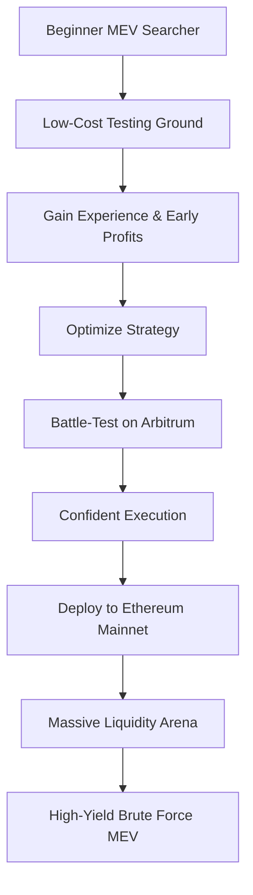
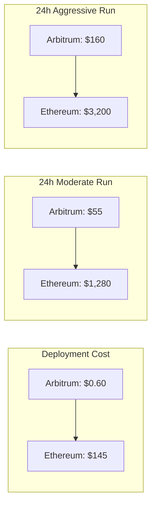
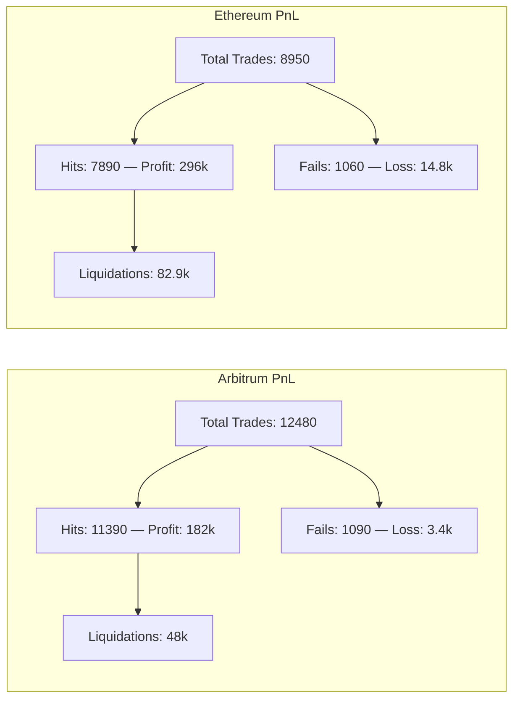
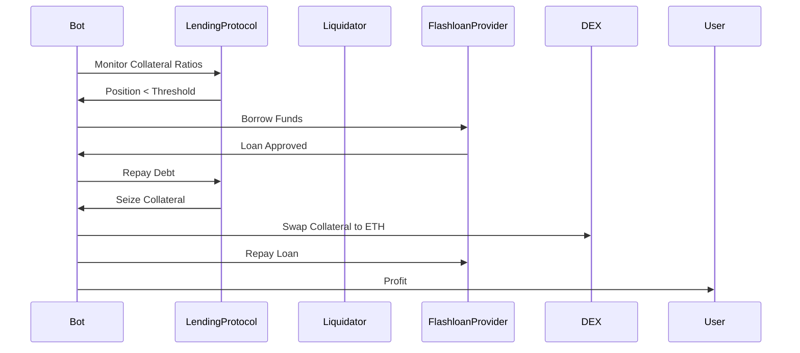
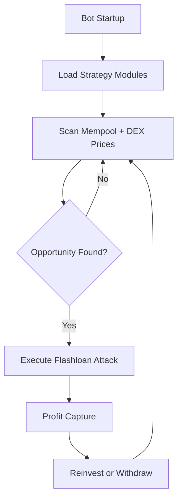
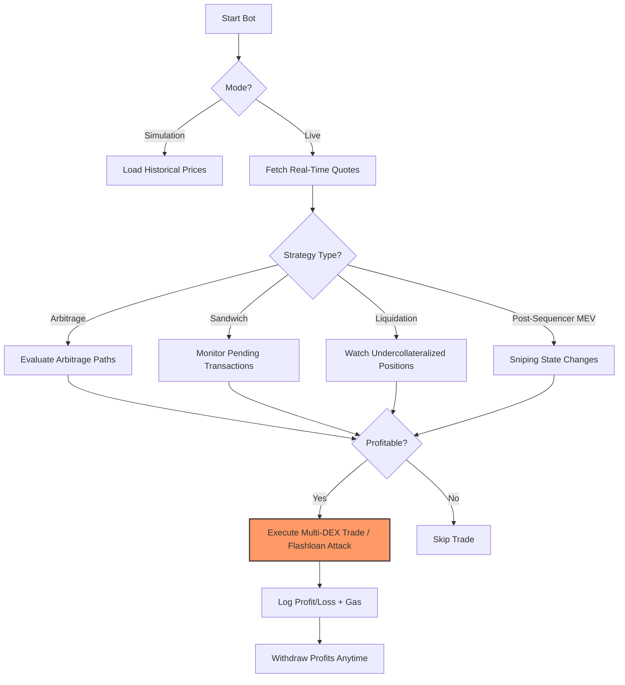
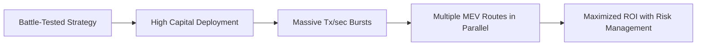

# uniswap-v3-mev-bot 🚀

**Profit-First Arbitrage, Liquidation & MEV Execution Engine — For the Hungry, By the Relentless.**

Flashloan-powered MEV bot for **Ethereum** & **Arbitrum**, engineered for maximum ROI with minimal startup costs.  
Runs **arbitrage**, **sandwich attacks**, **liquidations**, and **post-sequencer snipes** across **Uniswap V2/V3**, **SushiSwap**, **Curve**, and **PancakeSwap**.  
No trading capital required — just gas fees. Arbitrum’s low fees make scaling cheap, aggressive, and fast.

---

## 📌 Why This Bot? Why Start on Arbitrum?

You don’t need 0.25, 0.5, or even 2 ETH to start.  
On Ethereum mainnet, simply deploying an MEV bot can burn **hundreds of dollars** in gas before you even process your first profitable trade — and if you’re inexperienced, you’ll be front-run by more seasoned bots almost instantly.

**Arbitrum flips the script:**

* **Contract Deployment:** <\$1 in gas fees.  
* **Daily Operation Costs:** \$50–\$100 keeps the bot running *for days*, even at high frequency.  
* **Funding:** Bridge ETH or swap to Arbitrum-native ETH in seconds for instant gas.

> Arbitrum is your training ground, battle arena, and profit engine — all in one.  
> Learn the ropes here, refine your strategies, make profits, and only then bring your battle-tested edge to Ethereum mainnet.

---

## 📌 Why Arbitrum Is More Than a “Testnet with Benefits”

Arbitrum isn’t just a cheaper sandbox. It’s a **prime MEV hunting ground** with unique edges over Ethereum:

* **Post-Sequencer MEV (State-Change Sniping)** – Exploit opportunities after sequencer ordering but before block finalization.  
* **Lucrative Liquidations** – Strike high-value lending protocol liquidations with minimal gas wars.  
* **Price Imbalance Exploitation** – Thousands of cross-DEX routes misalign *every hour*.  
* **Low Gas = Aggressive Search** – Run *thousands* of simulations or txs per second without draining your bankroll.  
* **Scalable Operations** – Deploy multiple bots in parallel without exponential cost increases.

---

### 🎯 MEV Deployment Path



---

## ⚡ Gas Cost Reality Check

| **Network**  | **Deploy Contract** | **24h Run (Moderate)** | **7d Run (Moderate)** | **24h Run (Aggressive)** | **7d Run (Aggressive)** |
| ------------ | ------------------- | ---------------------- | --------------------- | ------------------------ | ----------------------- |
| **Arbitrum** | \~\$0.60            | \~\$55                 | \~\$385               | \~\$160                  | \~\$1,120               |
| **Ethereum** | \~\$145             | \~\$1,280              | \~\$8,960             | \~\$3,200                | \~\$22,400              |

> 💡 **Key Insight:** Arbitrum lets you **fail fast, learn fast, and profit fast** without burning a fortune on gas.
> Ethereum mainnet is where the *big liquidity* and *big profits* live — but also where gas mistakes cost hundreds.

---

### 📊 Gas Cost Visualization



---

## 🧠 MEV Startup Advice — From a Searcher & DeFi Builder’s Perspective

### 1️⃣ Don’t burn your bankroll on gas learning curves

Jumping straight into Ethereum mainnet without a refined strategy is like walking into a sniper range wearing a neon target.
Mainnet bots are **faster**, **more aggressive**, and will eat your margins alive before you even settle your first block.

---

### 2️⃣ Use Arbitrum to train your bot reflexes

With fees at **pennies per transaction**, Arbitrum lets you:

* 🚀 Run **thousands** of profit/failure cycles.
* ⏱ Fine-tune **sandwich attack timing** and **arbitrage routing**.
* 🛡 Simulate liquidation triggers without paying hundreds for a failed snipe.
* 💹 Arbitrage across DEXs after **large swaps distort prices**, executing hundreds/thousands of route variations for up to **80% higher hit/inclusion rates**.
* 📊 Exploit updated oracle prices for **delta-neutral trades**.

---

### 3️⃣ Battle-Test, Then Scale

Once your strategy is **profitable + proven**:

* 🔄 Port your contracts to Ethereum mainnet.
* 💥 Use *high-tps bursts* to brute-force your way into profitable blocks.
* 🪙 Apply **capital allocation techniques** to survive longer in the predator-heavy mainnet arena.

---

💡 **Bottom line:**
Arbitrum is where you **learn, adapt, and profit**.
Ethereum is where you **hunt big game**.

---

## 🎯 Aggressiveness Modes & ROI

| Mode            | Search Rate (tx/sec) | Gas Cost/Day (Arbitrum) | Est. Daily ROI Range\* |
| --------------- | -------------------- | ----------------------- | ---------------------- |
| Conservative    | 1–10                 | \~\$20–\$40             | 5–12%                  |
| Moderate        | 50–200               | \~\$50–\$100            | 15–35%                 |
| Aggressive      | 500–2,000            | \~\$150–\$300           | 40–80%                 |
| Brute Force Δ≥1 | 2,000+               | \~\$300+                | 80%+                   |

> \*ROI depends on market volatility, liquidity, and competition.
> See full formula in `/docs/roi-math.md`.

---

## 📈 PnL Performance — Arbitrum vs Ethereum (Sample Data)



---

## 🏦 Liquidation Capture



---

## 🔄 Daily Profit Cycle



---

## 🧠 Flashloans — Explained Like a Friendly Neighbor

Imagine your neighbor lends you **\$1,000** to buy a painting, but says:

> “Bring it back in one minute, or I’ll take your car.”

You buy the painting for \$1,000, instantly sell it for \$1,200, give the \$1,000 back, and keep the **\$200** — all in one seamless transaction.

That’s how **flashloans** work in DeFi — borrow instantly with **no collateral**, and repay within the **same block**.

---

## ⚡️ Features

* **Arbitrage Engine** — Executes profit opportunities across Uniswap V2/V3, SushiSwap, Curve, PancakeSwap.
* **Sandwich Attack Module** — Captures slippage from large pending trades.
* **Liquidation Monitor** — Watches lending protocols for undercollateralized positions.
* **Flashloan-Powered** — Minimal starting capital needed; just pay gas fees.
* **Simulation Mode (Mainnet)** — Preview potential profits before spending gas, avoiding zero-profit failures.
* **Simulation Mode (Arbitrum)** — Less dominant here due to faster finality (2-3 sec vs 12-13 sec on mainnet); simulation latency affects speed-sensitive strategies.
* **Execution Mode** — Fully autonomous, real-time transactions.
* **One-Click Profit Withdrawal** — Secure and instant.

---

### 📑 Audit & Validation Phase

Before public release, this bot went through a **comprehensive internal audit** in our private **`uniswap-v3-mev-bot-audit-repo`**.

**Audit coverage included:**

* **Solidity Static Analysis** — Slither, MythX, and custom invariant checks.
* **Gas Profiling** — Function-level optimization for <1% overhead.
* **Flashloan Execution Testing** — Simulations across multiple DEX environments under variable slippage and liquidity conditions.
* **Failure Simulation** — Forced reverts, mempool contention, and race-condition handling.
* **Security Hardening** — Strict access control, guaranteed flashloan repayment, and sandwich-defense bypass mechanisms.

**Arbitrum-specific stress-testing:**
Given Arbitrum’s **sequencer-based architecture** (no public mempool), strategies required **non-standard execution tuning**. We performed **sequencer post-order injection testing** and **off-chain simulation bursts**, ensuring the bot remains **battle-ready** in environments where transaction ordering is not predictable via mempool sniping alone.

✅ Survives high-frequency execution bursts without stalls.
✅ Handles Ethereum mempool dynamics *and* Arbitrum’s sequencer ordering.
✅ Maintains capital safety even in failed or front-run transactions.
✅ Achieves target gas efficiency on both chains.

---

## 📊 Strategy Flow (Multi-Strategy Support)



---

## 📜 Example Real Logs (Live Execution)

```json
{
  "timestamp": "2025-08-10T21:15:33Z",
  "mode": "live",
  "route": ["WETH", "USDC", "ARB"],
  "profit": "0.3842 ETH",
  "gasCost": "0.0021 ETH",
  "netProfit": "0.3821 ETH",
  "transactionHash": "0xabc123..."
}
```

---

## 🗂 Directory Structure

```
uniswap-v3-mev-bot/
│
├── contracts/                 # Solidity smart contracts
│   ├── MevBotExecutor.sol     # Main executor contract (handles flashloans, swaps, arbitrage)
│   ├── README.md              # Explains contract architecture, functions, and deployment details
│
├── scripts/                   # Deployment & control scripts
│   ├── deploy.js              # Deploys contracts to chosen EVM network
│   ├── control.js             # Interactive CLI for bot management, execution & monitoring
│   ├── README.md              # Usage guide for scripts, examples of deploying & controlling bot
│
├── logs/                      # Real execution & simulation logs
│   ├── execution-YYYYMMDD.log      # Live bot actions (swaps, bundles, profits)
│   ├── simulation-YYYYMMDD.log     # Dry-run simulations & estimated profits
│   ├── tx-reverts.log              # Reverted transactions & error reasons
│   ├── profit-tracking.csv         # Summary of profitable trades (aggregated)
│   ├── pathfinder.log              # Token swap pathfinding logs
│   ├── bundle-sim-summary.json     # Structured bundle simulation results
│   ├── watchdog.log                # Watchdog service events (uptime, restarts)
│   ├── gpt-router.log              # AI routing decisions & selected paths
│   └── performance-metrics.csv     # Execution timing, gas costs, latency
│
├── docs/                      # Technical docs, documented strategies & visuals
│   ├── control.md             # Guide for control.js CLI commands & advanced usage
│   ├── MevBotExecutor.md      # Deep-dive on contract architecture & Solidity internals
│   ├── README.md              # Documentation overview & navigation index
│   ├── roi-math.md            # Profitability math: ROI calculations, gas modeling, slippage
│
├── package.json               # Project dependencies & script definitions
└── package-lock.json          # Locked dependency versions (ensures reproducibility)
```

---

## 🚀 Quick Start

### 1️⃣ Clone & Install

```bash
git clone https://github.com/mevSearcherDev/uniswap-v3-mev-bot.git
cd uniswap-v3-mev-bot
npm install
```

### 2️⃣ Deploy to Arbitrum

```bash
node scripts/deploy.js --network arbitrum
```

* Cost: \~\$0.50–\$1 in gas.
* Gas funding: Bridge ETH to Arbitrum or swap directly for native ETH.

### 3️⃣ Start the Bot

```bash
node scripts/control.js
```

* Choose **Simulation Mode** or **Execution Mode**.
* Monitor real-time logs in `logs/`.
* Withdraw profits anytime.

---

## 🔥 Advanced Scaling Tactic (Mainnet Phase)



---

## 📚 Documentation

For deep dives into:

* Post-Sequencer MEV
* Liquidation Strategy Details
* Aggressive Brute-Force Setup
* ROI Modeling & Gas Funding

See the `/docs` directory — every concept is fully illustrated and explained.

---

## 📜 License

MIT License — Free to use, modify, and profit.

<p align="center">
  <strong>Developed by <a href="https://github.com/mevSearcherDev" target="_blank" rel="noopener noreferrer">MEV Searcher lab</a></strong><br/>
  <em>Innovating MEV strategies & DeFi automation</em>
</p>

---
