```mermaid
flowchart TD
    A[👨‍💻 Operator] -->|Runs CLI| B[📟 scripts/control.js]
    B -->|Calls Functions| C[⚙️ MEVBotExecutor Contract]
    C -->|Executes| D[(⛓ On-chain State/Actions)]
```

```mermaid
flowchart TD
    subgraph Local[💻 Local Environment]
        A[👨‍💻 Operator]
        B[📟 control.js CLI]
    end

    subgraph Chain[🔗 Arbitrum Mainnet]
        C[⚙️ MEVBotExecutor Contract]
        D[(Liquidity Pools / DEXes)]
    end

    A --> B
    B --> C
    C --> D
```

```mermaid
sequenceDiagram
    participant O as 👨‍💻 Operator
    participant CLI as 📟 control.js
    participant BOT as ⚙️ MEVBotExecutor
    participant CHAIN as ⛓ On-chain

    O->>CLI: Select "Run Aave Flashloan"
    CLI->>BOT: call kickAaveFlashloan()
    BOT->>CHAIN: Execute flashloan, swaps, settlement
    CHAIN-->>BOT: Return balances/events
    BOT-->>CLI: Emit AuxLog, status
    CLI-->>O: Display results
```

# 📟 `scripts/control.js` — Operator Console

The **Control Script** is the operator-facing CLI for interacting with the deployed **`MEVBotExecutor`** contract.
It provides a **guided, menu-based interface** for manual testing, monitoring, and contract management.

---

## 🎯 Purpose

* Serve as a **human-in-the-loop** console for the MEV bot.
* Allow the deployer/operator to **inspect state**, **tweak parameters**, and **invoke execution functions** directly.
* Act as a **safe test harness** while the **full autonomous automation layer** is undergoing formal audit.

---

## ✅ What It Can Do (Current Features)

* **Status Dashboard**: View contract state (owner, providers, slippage, profit token, balances, Z1/Z2).
* **Config Management**: Update simulation mode, slippage, quoter, Radiant pool/data, UI provider.
* **DEX Registry**: Register/query DEX entries.
* **Execution Hooks**: Kick flashloans (Aave, Radiant), run swap legs, simulate routes.
* **Liquidations & Health**: Execute liquidation, check user health.
* **Debug Internals**: Retrieve messages, inspect Z1/Z2.
* **Ownership/Treasury**: Transfer ownership, withdraw tokens.
* **Event Listener**: Watch emitted logs live.

---

## ❌ Limitations

* No autonomous execution
* No strategy logic / AI routing
* No bundling or Flashbots submission
* No continuous monitoring
* No risk modeling

---

## 🔒 Audit Status

The **autonomous automation layer** (AI routing, bundle simulation, Flashbots, watchdog) is in **active audit** in the private audit repo.
Until it’s complete, `control.js` is the **recommended entry point**.

---

## 🛠 Usage

```bash
npx hardhat run scripts/control.js --network arbitrum
```

Env requirements:

```ini
PRIVATE_KEY=0x...
MEVBOT_ADDRESS=0x...
```

---

# 📟 `scripts/autonomousControl.js` — Operator Console

The **Control Script** is the skeleton structure of the autonomous operator-facing CLI for interacting with the deployed **`MEVBotExecutor`** contract.
It provides a **guided, menu-based interface** for manual testing, monitoring, and contract management.

---

## 🎯 Purpose

* Serve as a **human-in-the-loop** console for the MEV bot.
* Allow the deployer/operator to **inspect state**, **tweak parameters**, and **invoke execution functions** directly.
* Act as a **safe test harness** while the **complete autonomous automation layer** is undergoing formal audit.

---

## ✅ What It Can Do (Current Features)

* **Status Dashboard**: View contract state (owner, providers, slippage, profit token, balances, Z1/Z2).
* **Config Management**: Update simulation mode, slippage, quoter, Radiant pool/data, UI provider.
* **DEX Registry**: Register/query DEX entries.
* **Execution Hooks**: Kick flashloans (Aave, Radiant), run swap legs, simulate routes.
* **Liquidations & Health**: Execute liquidation, check user health.
* **Debug Internals**: Retrieve messages, inspect Z1/Z2.
* **Ownership/Treasury**: Transfer ownership, withdraw tokens.
* **Event Listener**: Watch emitted logs live.

---

## ❌ Limitations

* No autonomous execution
* No strategy logic / AI routing
* No bundling or Flashbots submission
* No continuous monitoring
* No risk modeling

---

## 🔒 Audit Status

The **autonomous automation layer** (AI routing, bundle simulation, Flashbots, watchdog) is in **active audit** in the private audit repo.
Until it’s complete, `control.js` is the **recommended entry point**.

---

## 🛠 Usage

```bash
npx hardhat run scripts/control.js --network arbitrum
```

Env requirements:

```ini
PRIVATE_KEY=0x...
MEVBOT_ADDRESS=0x...
```

---

### 🛠 Arb Path Finder Utility

This module discovers multi-hop token swap paths across DEX routers on Arbitrum.

**Example usage:**

```bash
node -e "console.log(require('./utils/arbPathFinder').findArbPaths('WETH','USDC',['uniswapV2']))"
```

Output:

```
WETH -> USDC
```

> Note: Currently returns a placeholder path. Full pathfinding will be implemented in future updates.

---

# 🖼 Visual Lifelines & Flowcharts

### 1. Top-Down (TD) Control Flow



---

### 2. TD with Subgraphs



---

### 3. Lifeline (Sequence Diagram, LD Style)



---

### 4. (Subgraph TD — Human vs Autonomous)


---

---

# 🖼 Visual Lifelines & Flowcharts

### 1. Top-Down (TD) Control Flow


---

### 2. TD with Subgraphs


---

### 3. Lifeline (Sequence Diagram, LD Style)


---

### 4. (Subgraph TD — Human vs Autonomous)


---
