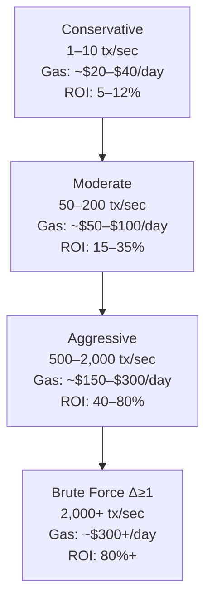
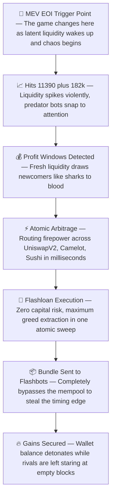

## 🎯 Aggressiveness Modes & ROI

---

### 📐 ROI Formula

We use the **daily ROI** calculation:

$$
\text{ROI\%} = \frac{\text{Net Profit (per day)}}{\text{Daily Gas Cost}} \times 100
$$

Where:

* **Net Profit** = *(Gross Arbitrage Gains – Failed TX Losses – Gas Cost)*
* **Gross Arbitrage Gains** = Σ(Δ \* Trade Size) over all profitable fills
* **Failed TX Losses** = Losses from reverted / outbid transactions
* **Gas Cost** = (Gas used per TX × Gas Price × Number of TXs)

---

### 🔢 Example Calculation (Moderate Mode)

Let’s take **Moderate Mode** (≈100 tx/sec):

1. **Gas Usage**

   * Assume: 210,000 gas per trade (avg Arbitrum swap bundle)
   * Gas Price: 0.1 gwei (Arbitrum average)
   * 100 tx/sec × 86,400 sec/day = 8.64M tx/day
   * Daily Gas Cost ≈ $8.64M \times 210,000 \times 0.1 \text{ gwei}$ ≈ **\$75/day**

2. **Profitability**

   * Average Δ per hit: 0.003 ETH (\~\$10)
   * Hit rate: 0.05% (432 successful tx/day)
   * Gross Gains: ≈ \$4,320/day
   * Net Profit = \$4,320 – \$75 gas ≈ \$4,245

3. **ROI%**

   $$
   \frac{4,245}{75} \times 100 \approx 5,660\% \ \text{(very high in this example, but rare in real markets)}
   $$

---

### ⚠️ Factors That Impact ROI

* **Market Volatility** → Higher Δ and more frequent opportunities
* **Liquidity Depth** → Lower slippage on large size
* **Competition** → More failed bundles and gas burn
* **Latency** → Directly impacts hit rate

---

## **💎 The Turning Point — Your First Taste of Real MEV Profits**

You’ve been running simulations. You’ve seen the charts.
But now… it’s **real**.

At this exact stage, you’re standing at the **Event of Impact (EOI)** — the moment where testing ends, and **live profit begins**.

In MEV, there are no second places.
You either execute flawlessly and claim the reward… or you watch someone else walk away with it.

### **Your Mission**

* Identify **high-confidence arbitrage gaps** from the scanner
* Deploy a **single, precision-engineered** flashloan
* Capture the delta before the mempool predators even sniff it

### **Why This Moment Matters**

Most people **never get here** — they tinker, they hesitate, they watch opportunities fly by.
You? You’re about to pull the trigger.

💰 **One trade is all it takes** to go from testing to **self-funding execution loops**.

---

