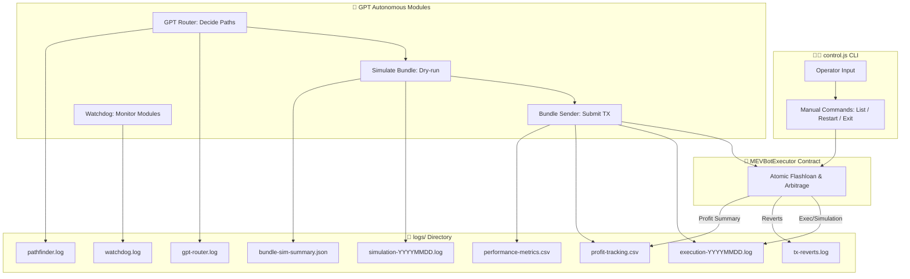

# 📜 Logs Directory

This directory contains all runtime and simulation logs for the **MEV Bot**.

## Structure

```
logs/
├── execution-YYYYMMDD.log      # Live bot actions (swaps, bundles, profits)
├── tx-reverts.log              # Reverted transactions & error reasons
├── profit-tracking.csv         # Summary of profitable trades
├── simulation-YYYYMMDD.log     # Dry-run simulations & estimated profits
├── pathfinder.log              # Token swap pathfinding logs
├── bundle-sim-summary.json     # Structured bundle simulation results
├── watchdog.log                # Watchdog service events (uptime, restarts)
├── gpt-router.log              # AI routing decisions & selected paths
└── performance-metrics.csv     # Execution timing, gas costs, latency
```

---

## File Descriptions & Sample Entries

### 1. **execution-YYYYMMDD.log**

Live bot actions (swaps, bundles, profits).

```text
[2025-08-17 15:42:11] INFO: Flashloan executed: 1000 WETH -> 1.2M USDC profit estimated
[2025-08-17 15:42:12] INFO: Bundle submitted to sequencer
[2025-08-17 15:42:15] SUCCESS: Bundle executed, net profit 1.18M USDC
```

---

### 2. **tx-reverts.log**

Reverted transactions & error reasons.

```text
[2025-08-17 15:40:03] ERROR: Transaction 0xabc123 reverted: "INSUFFICIENT_LIQUIDITY"
[2025-08-17 15:41:22] ERROR: Transaction 0xdef456 reverted: "SLIPPAGE_TOO_HIGH"
```

---

### 3. **profit-tracking.csv**

Summary of profitable trades.

```csv
timestamp,txHash,profitToken,amount,gasUsed,netProfit
2025-08-17T15:42:15,0x987abc,USDC,1200000,350000,1180000
2025-08-17T15:45:09,0x654def,USDC,500000,120000,380000
```

---

### 4. **simulation-YYYYMMDD.log**

Dry-run simulations showing expected profits.

```text
[2025-08-17 14:00:00] SIMULATION: Path WETH->USDC->ARB estimated profit 12,500 USDC
[2025-08-17 14:00:05] SIMULATION: Path USDC->WETH->ARB skipped (negative delta)
```

---

### 5. **pathfinder.log**

Token swap paths explored.

```text
[2025-08-17 13:55:01] INFO: Explored path: WETH -> USDC -> ARB
[2025-08-17 13:55:02] INFO: Explored path: WETH -> DAI -> USDC -> ARB
```

---

### 6. **bundle-sim-summary.json**

Structured simulation results for bundles.

```json
{
  "bundleId": "b12345",
  "simulatedAt": "2025-08-17T14:05:00Z",
  "paths": [
    {"path": ["WETH","USDC","ARB"], "estimatedProfit": 12500},
    {"path": ["USDC","WETH","ARB"], "estimatedProfit": -200}
  ],
  "successProbability": 0.87
}
```

---

### 7. **watchdog.log**

Records watchdog service events.

```text
[2025-08-17 15:00:00] INFO: Watchdog started
[2025-08-17 15:30:10] WARNING: Watchdog detected stalled simulation module, restarting
[2025-08-17 15:31:00] INFO: Watchdog restart complete
```

---

### 8. **gpt-router.log**

AI routing decisions.

```text
[2025-08-17 14:50:10] GPT Router: Selected path WETH -> USDC -> ARB
[2025-08-17 14:50:12] GPT Router: Predicted delta 1.022, will proceed with bundle
```

---

### 9. **performance-metrics.csv**

Execution timing, gas, and latency.

```csv
timestamp,module,executionTimeMs,gasUsed,latencyMs
2025-08-17T15:42:11,flashloan,1200,350000,45
2025-08-17T15:42:15,bundleSubmit,800,0,12
```

---



### Description of Flow

1. **Manual Mode (`control.js CLI`)**

   * Operator inputs commands.
   * Direct calls to `MEVBotExecutor`.
   * Generates execution logs, revert logs, and profit summaries.

2. **Autonomous AI Mode**

   * GPT Router determines the optimal token paths.
   * Simulate Bundle runs dry-runs to predict profitability.
   * Bundle Sender submits actual transactions to the contract.
   * Watchdog monitors modules for errors, stalls, and restarts.
   * Logs capture everything from AI decisions to bundle simulations.

3. **Logs Directory**

   * Each module produces structured logs.
   * Enables auditing, backtesting, and monitoring of both manual and autonomous flows.

---

## Best Practices

* **Rotate logs** daily or when exceeding size limits.
* **Separate simulation and execution logs**.
* **Always timestamp entries** for correlation across modules.
* **Use JSON or CSV** for structured logs to enable automated analysis.
* **Never commit sensitive info** like private keys or wallet credentials.

---

