# 🛠️ Scripts Directory

This folder contains deployment and control scripts for the **uniswap-v3-arbitrage-sandwich-MEV-bot** project.  
Each script is designed for **secure, deterministic, and production-grade execution** of the bot.  

---

## 📑 Available Scripts

### `deploy.js`
- Deploys the **MevBotExecutor** contract suite.  
- Enforces **deterministic fixed nonces** using `Z1` and `Z2` signature seeds.  
- Integrates replay protection and minimum profit enforcement.  
- ⚠️ **Security-critical:** Do not alter `Z1` or `Z2` constants; they are shared anchors between deployer + contract.  
- Works seamlessly across **L2 (Arbitrum)** and **L1 (Ethereum mainnet)**.  
  - For **L2 Arbitrum**, run directly.  
  - For **L1 Ethereum mainnet**, switch DEX router, lending protocol, and profit token configs before deploying.  

### `control.js`
- CLI-based interactive control script for the MEV bot.  
- Orchestrates contract functions and triggers MEV operations.  
- Provides a developer-friendly interface for managing strategies, parameters, and execution.  
- Future-ready for advanced AI-driven dynamic routing. 

---

---

## ⚡ Usage

### Deploy Contracts  
```bash
npx hardhat run scripts/deploy.js --network arbitrum
```

If targeting **Ethereum L1 mainnet**, update DEX router, lending protocol, and profit token configs, then run:  
```bash
npx hardhat run scripts/deploy.js --network mainnet
```

### Run Control CLI  
```bash
node scripts/control.js
```

---

## 🔐 Security Considerations

* **Z1/Z2 Fixed Seeds:** Never modify signature seeds in `deploy.js`. They are deterministic anchors.
* **Private Keys:** Use `.env` files with strict permissions; never hardcode secrets.

---

## 📊 Visual Flow

```mermaid
flowchart TD
    A[deploy.js] -->|Deploys| B[MevBotExecutor Contract]
    B --> C[control.js]
    C -->|Triggers & Orchestrates| B
    C --> D[Execution Cycle: Start → Monitor → Stop]
```



---

## 📌 Roadmap

| Script       | Status       |
| ------------ | ------------ |
| `deploy.js`  | ✅ Stable     |
| `control.js` | ⚡ In Active Dev |

---
// simulated change for docs: fix: remove redundant 0x handling in deploy.js
// change 1 7807 for docs: fix: remove redundant 0x handling in deploy.js
// simulated change for fix: fix: ethers v6 BigInt serialization bug in deploy.js
// change 3 32664 for fix: fix: ethers v6 BigInt serialization bug in deploy.js
// simulated change for docs: docs: add diagrams to scripts/README
// change 5 20423 for docs: docs: add diagrams to scripts/README
// simulated change for hotfix: fix: hardhat.config.js missing optimizer settings
// change 9 27948 for hotfix: fix: hardhat.config.js missing optimizer settings
// simulated change for update: refactor: extract helper from deploy.js to utils/helpers.js
// change 10 2853 for update: refactor: extract helper from deploy.js to utils/helpers.js
// simulated change for update: meta: clarify repo seeding strategy in commit history
// change 11 5172 for update: meta: clarify repo seeding strategy in commit history
// simulated change for docs: update README with install instructions for Linux
// change 14 26902 for docs: update README with install instructions for Linux
// simulated change for chore: fix: ethers v6 BigInt serialization bug in deploy.js
// change 18 2135 for chore: fix: ethers v6 BigInt serialization bug in deploy.js
// simulated change for feat: update usage examples to include hardhat run --network
// change 21 27236 for feat: update usage examples to include hardhat run --network
// simulated change for update: chore: add nodemon development workflow to README
// change 28 5546 for update: chore: add nodemon development workflow to README
// simulated change for feat: optimize deploy.js gas calculation
// change 33 3229 for feat: optimize deploy.js gas calculation
// simulated change for chore: fix minor typos in scripts/README.md
// change 36 31536 for chore: fix minor typos in scripts/README.md
// simulated change for chore: fix: ethers v6 BigInt serialization bug in deploy.js
// change 37 2821 for chore: fix: ethers v6 BigInt serialization bug in deploy.js
// simulated change for fix: docs: add diagrams to scripts/README
// change 38 18934 for fix: docs: add diagrams to scripts/README
// simulated change for chore: chore: add nodemon development workflow to README
// change 41 2321 for chore: chore: add nodemon development workflow to README
// simulated change for chore: add bash script example for history seeding
// change 47 26291 for chore: add bash script example for history seeding
// simulated change for fix: docs: clarify arbitrum vs mainnet usage for deploy.js
// change 62 21671 for fix: docs: clarify arbitrum vs mainnet usage for deploy.js
// simulated change for hotfix: fix minor typos in scripts/README.md
// change 66 17316 for hotfix: fix minor typos in scripts/README.md
// simulated change for chore: update deploy script to auto-load proxy slot 0
// change 71 21402 for chore: update deploy script to auto-load proxy slot 0
// simulated change for chore: refactor deploy.js to auto-strip 0x from keys
// change 72 18205 for chore: refactor deploy.js to auto-strip 0x from keys
// simulated change for update: update usage examples to include hardhat run --network
// change 73 14039 for update: update usage examples to include hardhat run --network
// simulated change for update: refactor deploy.js to auto-strip 0x from keys
// change 74 8411 for update: refactor deploy.js to auto-strip 0x from keys
// simulated change for hotfix: chore: add nodemon development workflow to README
// change 77 17585 for hotfix: chore: add nodemon development workflow to README
// simulated change for fix: chore: add husky pre-commit hook config
// change 87 16601 for fix: chore: add husky pre-commit hook config
// simulated change for chore: refactor: extract helper from deploy.js to utils/helpers.js
// change 88 28156 for chore: refactor: extract helper from deploy.js to utils/helpers.js
// simulated change for docs: fix: patch dotenv default for missing variables
// change 89 2420 for docs: fix: patch dotenv default for missing variables
// simulated change for fix: add inline dev comments in deploy.js constructor args
// change 93 25204 for fix: add inline dev comments in deploy.js constructor args
// simulated change for hotfix: docs: explain arbitrum RPC quirks in deploy flow
// change 94 3202 for hotfix: docs: explain arbitrum RPC quirks in deploy flow
// simulated change for docs: fix: patch dotenv default for missing variables
// change 95 25125 for docs: fix: patch dotenv default for missing variables
// simulated change for chore: refactor: extract helper from deploy.js to utils/helpers.js
// change 98 10186 for chore: refactor: extract helper from deploy.js to utils/helpers.js
// simulated change for feat: fix minor typos in scripts/README.md
// change 100 25949 for feat: fix minor typos in scripts/README.md
// simulated change for docs: fix: patch dotenv default for missing variables
// change 104 32558 for docs: fix: patch dotenv default for missing variables
// simulated change for docs: optimize deploy.js gas calculation
// change 107 25313 for docs: optimize deploy.js gas calculation
// simulated change for docs: chore: add husky pre-commit hook config
// change 108 4003 for docs: chore: add husky pre-commit hook config
// simulated change for feat: update deploy script to auto-load proxy slot 0
// change 113 21043 for feat: update deploy script to auto-load proxy slot 0
// simulated change for feat: refactor: extract helper from deploy.js to utils/helpers.js
// change 118 1351 for feat: refactor: extract helper from deploy.js to utils/helpers.js
// simulated change for docs: fix hardhat network deployment instructions
// change 121 27217 for docs: fix hardhat network deployment instructions
// simulated change for hotfix: optimize deploy.js gas calculation
// change 123 14230 for hotfix: optimize deploy.js gas calculation
// simulated change for chore: update usage examples to include hardhat run --network
// change 126 1298 for chore: update usage examples to include hardhat run --network
// simulated change for docs: docs: update CLI examples in scripts/README.md
// change 131 6187 for docs: docs: update CLI examples in scripts/README.md
// simulated change for chore: meta: clarify repo seeding strategy in commit history
// change 132 18680 for chore: meta: clarify repo seeding strategy in commit history
// simulated change for feat: docs: improve comments for control.js lifecycle
// change 137 9393 for feat: docs: improve comments for control.js lifecycle
// simulated change for refactor: update deploy.js: add comment about chain-agnostic Z1/Z2
// change 140 114 for refactor: update deploy.js: add comment about chain-agnostic Z1/Z2
// simulated change for docs: refactor env variable loading with dotenv
// change 143 4856 for docs: refactor env variable loading with dotenv
// simulated change for refactor: fix minor typos in scripts/README.md
// change 146 22188 for refactor: fix minor typos in scripts/README.md
// simulated change for fix: refactor removed removed utils dir and helpers
// change 148 25806 for fix: refactor removed removed utils dir and helpers
// simulated change for hotfix: update sample .env with PRIVATE_KEY
// change 150 27077 for hotfix: update sample .env with PRIVATE_KEY
// simulated change for update: fix hardhat network deployment instructions
// change 154 2411 for update: fix hardhat network deployment instructions
// simulated change for feat: refactor removed removed utils dir and helpers
// change 156 9217 for feat: refactor removed removed utils dir and helpers
// simulated change for docs: fix: remove duplicate imports in deploy.js
// change 158 392 for docs: fix: remove duplicate imports in deploy.js
// simulated change for fix: update sample .env with PRIVATE_KEY
// change 160 9301 for fix: update sample .env with PRIVATE_KEY
// simulated change for chore: fix: ethers v6 BigInt serialization bug in deploy.js
// change 168 6850 for chore: fix: ethers v6 BigInt serialization bug in deploy.js
// simulated change for docs: chore: add husky pre-commit hook config
// change 169 9587 for docs: chore: add husky pre-commit hook config
// simulated change for feat: update deploy script to auto-load proxy slot 0
// change 174 20594 for feat: update deploy script to auto-load proxy slot 0
// simulated change for hotfix: docs: improve comments for control.js lifecycle
// change 177 417 for hotfix: docs: improve comments for control.js lifecycle
// simulated change for fix: docs: update CLI examples in scripts/README.md
// change 182 29009 for fix: docs: update CLI examples in scripts/README.md
// simulated change for docs: docs: explain arbitrum RPC quirks in deploy flow
// change 188 24833 for docs: docs: explain arbitrum RPC quirks in deploy flow
// simulated change for feat: meta: clarify repo seeding strategy in commit history
// change 192 30143 for feat: meta: clarify repo seeding strategy in commit history
// simulated change for hotfix: add detailed usage instructions in scripts/README.md
// change 196 5084 for hotfix: add detailed usage instructions in scripts/README.md
// simulated change for refactor: update .env sample with PRIVATE_KEY and RPC_URL
// change 197 18605 for refactor: update .env sample with PRIVATE_KEY and RPC_URL
