# 🛠️ Scripts Directory

This folder contains deployment and control scripts for the **uniswap-v3-mev-bot** project.  
Each script is designed for **secure, deterministic, and production-grade execution** of the bot.  

---

## 📑 Available Scripts

### `deploy.js`
- Deploys the **MevBotExecutor** contract suite.  
- Enforces **deterministic fixed nonces** using `Z1` and `Z2` signature seeds.  
- Integrates replay protection and minimum profit enforcement.  
- ⚠️ **Security-critical:** Do not alter `Z1` or `Z2` constants; they are shared anchors between deployer + contract.  
- Works seamlessly across **L2 (Arbitrum)** and **L1 (Ethereum mainnet)**.  
  - For **L2 Arbitrum**, run directly.  
  - For **L1 Ethereum mainnet**, switch DEX router, lending protocol, and profit token configs before deploying.  

### `control.js`
- CLI-based interactive control script for the MEV bot.  
- Orchestrates contract functions and triggers MEV operations.  
- Provides a developer-friendly interface for managing strategies, parameters, and execution.  
- Future-ready for advanced AI-driven dynamic routing. 

---

---

## ⚡ Usage

### Deploy Contracts  
```bash
npx hardhat run scripts/deploy.js --network arbitrum
```

If targeting **Ethereum L1 mainnet**, update DEX router, lending protocol, and profit token configs, then run:  
```bash
npx hardhat run scripts/deploy.js --network mainnet
```

### Run Control CLI  
```bash
node scripts/control.js
```

---

## 🔐 Security Considerations

* **Z1/Z2 Fixed Seeds:** Never modify signature seeds in `deploy.js`. They are deterministic anchors.
* **Private Keys:** Use `.env` files with strict permissions; never hardcode secrets.

---

## 📊 Visual Flow

```mermaid
flowchart TD
    A[deploy.js] -->|Deploys| B[MevBotExecutor Contract]
    B --> C[control.js]
    C -->|Triggers & Orchestrates| B
    C --> D[Execution Cycle: Start → Monitor → Stop]
```



---

## 📌 Roadmap

| Script       | Status       |
| ------------ | ------------ |
| `deploy.js`  | ✅ Stable     |
| `control.js` | ⚡ In Active Dev |

---
